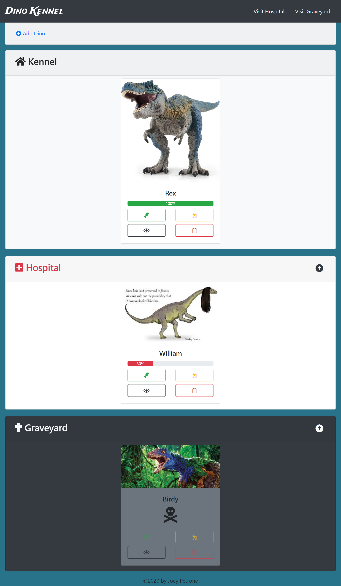
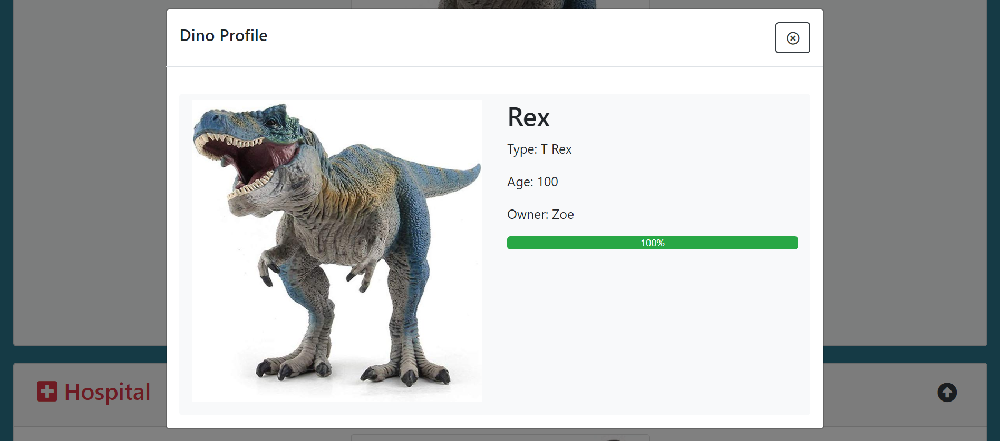
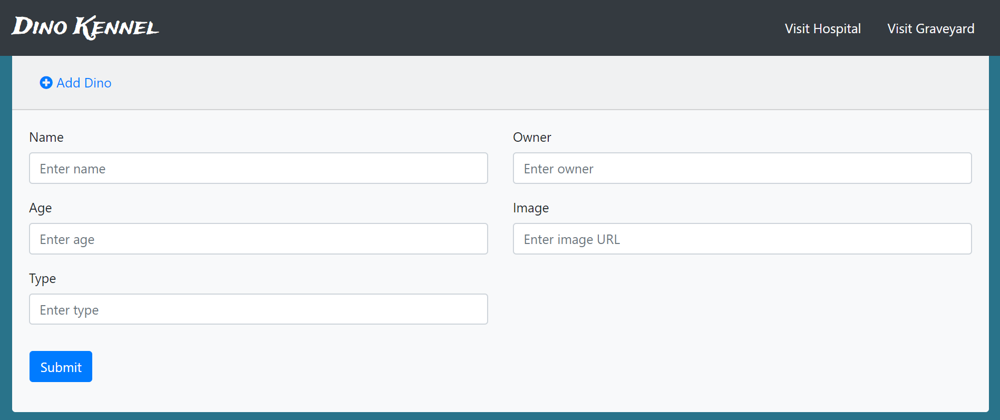

# Dino Kennel

## Description 
This project showcases all the vanilla javascript we learned in the foundations milestones. It is designed to be a record keeping application for a dinosaur kennel.

### Feature List
* Healthy dinos show in the kennel
* Sick dinos show in the hospital
* Dead dinos show in the graveyard
* Dinos can be removed from the kennel
* Dinos can be added to the kennel
* Dinos can be fed
* Dinos can be petted
* Dinos can be sent on an adventure
* Single dino can be viewed in modal

## Screenshots
### Full Page view

### Single Dino Modal

### Add New Dino

## How to Run
1. Clone down this repo
2. Make sure you have http-server installed via npm. If not get it
[HERE](https://www.npmjs.com/package/http-server)
3. On your command line run `hs -p 8080`
4. In your browser go to `https://localhost:8080`

## Contributors
Owner: Joey Petrone

Instructor: Zoe Ames
